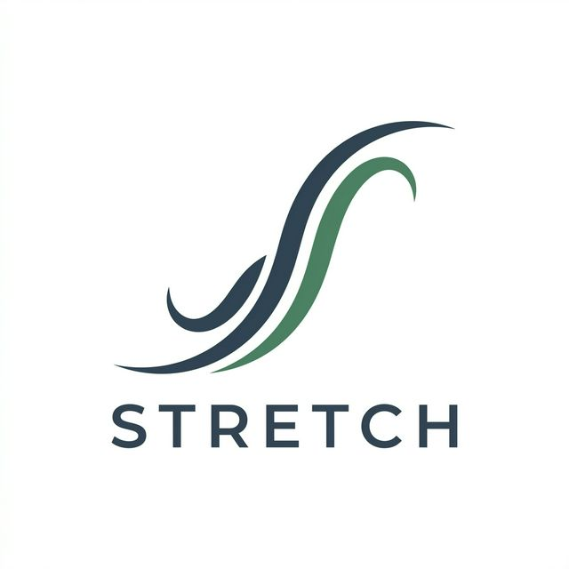

# Stretch

(https://stretchapp.in)

> A quiet menu bar / tray app for macOS and Windows that invites you to stretch for one minute, every so often. Local only. No account. No telemetry.



## Install

Download the latest release:

- **macOS:** [Stretch-1.0.0.dmg](https://github.com/praveensankar969/stretch/releases/download/latest/Stretch-1.0.0.dmg) — ad-hoc signed, universal (arm64 + x64). Right-click → Open on first launch.
- **Windows:** [Stretch-1.0.0.exe](https://github.com/praveensankar969/stretch/releases/download/latest/Stretch-1.0.0.exe) — signed NSIS installer, auto-updates via GitHub Releases.

macOS 12+ (Monterey and later) and Windows 10/11 are supported.

## What's inside

- **Electron 30**, single-window menu bar / tray app with a preload-based `contextBridge` API.
- **Morning Light** design system (Fraunces display + Instrument Sans body, warm-ink palette).
- **Lottie-web** for the exercise line-art loops — one JSON file per exercise, generated from a compact keyframe spec via `scripts/build-lottie.mjs`.
- **electron-updater** pointed at GitHub Releases (Windows; macOS pending signed build).

## Develop

```bash
npm install      # fetches fonts, builds Lottie loops, copies lottie-web vendor
npm start        # runs the app in dev (no login-item registration)
```

Key scripts:

- `npm run fonts` — downloads Fraunces + Instrument Sans woff2 files into `src/assets/fonts/`. Runs automatically on install.
- `npm run lottie` — regenerates the ten exercise JSON files in `src/assets/lottie/` from `scripts/build-lottie.mjs`.
- `npm run vendor` — copies `lottie-web`'s player bundle into `src/vendor/` so the app can load it under strict CSP.
- `npm run icons` — generates `build/icon.ico`, `build/icon.icns`, and macOS template tray icons from `logo.png`.

## File map

```
main.js                   Electron main (tray, scheduling, DND, updater)
src/
  preload.js              contextBridge API exposed as window.stretch
  index.html / renderer.js settings screen
  onboarding.html / onboarding.js first-run
  overlay.html / overlay.css / overlay.js the reminder experience
  shared/exercises.js     single source of truth (used by main + overlay)
  assets/
    tokens.css            Morning Light palette + type + motion tokens
    fonts.css             self-hosted @font-face
    fonts/                woff2 files (downloaded by scripts/fetch-fonts.mjs)
    lottie/               ten exercise loops (generated)
    grain.svg             3% grain overlay
    icon.ico              Windows app icon (generated)
    tray.png              Windows tray fallback (generated)
    tray-Template.png     macOS menu bar icon 20px (generated)
    tray-Template@2x.png  macOS menu bar icon 40px (generated)
  vendor/                 lottie-web (copied from node_modules at postinstall)
scripts/
  fetch-fonts.mjs         Google Fonts → src/assets/fonts/
  build-lottie.mjs        keyframe spec → src/assets/lottie/*.json
  copy-vendor.mjs         node_modules/lottie-web → src/vendor/
  build-icons.mjs         logo.png → build/icon.ico, build/icon.icns, tray templates
website/
  index.html / style.css  marketing site (static)
  privacy.html            privacy note
  favicon.svg
build/
  installer.nsh           NSIS post-install messaging (Windows)
  icon.ico                generated by npm run icons
  icon.icns               generated by npm run icons (macOS)
PRIVACY.md, CHANGELOG.md, LICENSE
```

## Releasing

1. Bump `version` in `package.json`.
2. Update `CHANGELOG.md`.
3. Commit and tag: `git tag v1.1.0 && git push --tags`.
4. **Windows:** `npm run release`. electron-builder signs the NSIS installer and uploads artefacts to the matching GitHub Release draft.
5. **macOS:** `npm run release:mac`. Produces ad-hoc signed DMG and zip for arm64 + x64.

## Contributing

- Bugs: open an issue with the output of **Copy diagnostics** from the app footer.
- Exercises: edit `src/shared/exercises.js` and cite a public source (NHS, ACE Fitness, Mayo Clinic) in the comment above your entry.

## Licence

MIT. See [LICENSE](./LICENSE).
